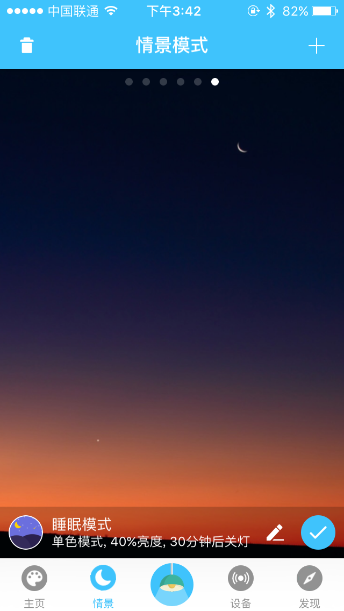
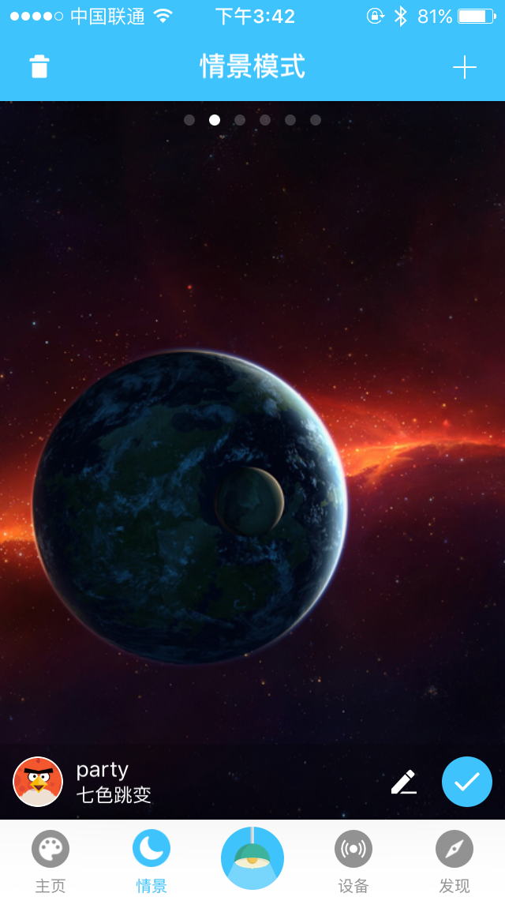
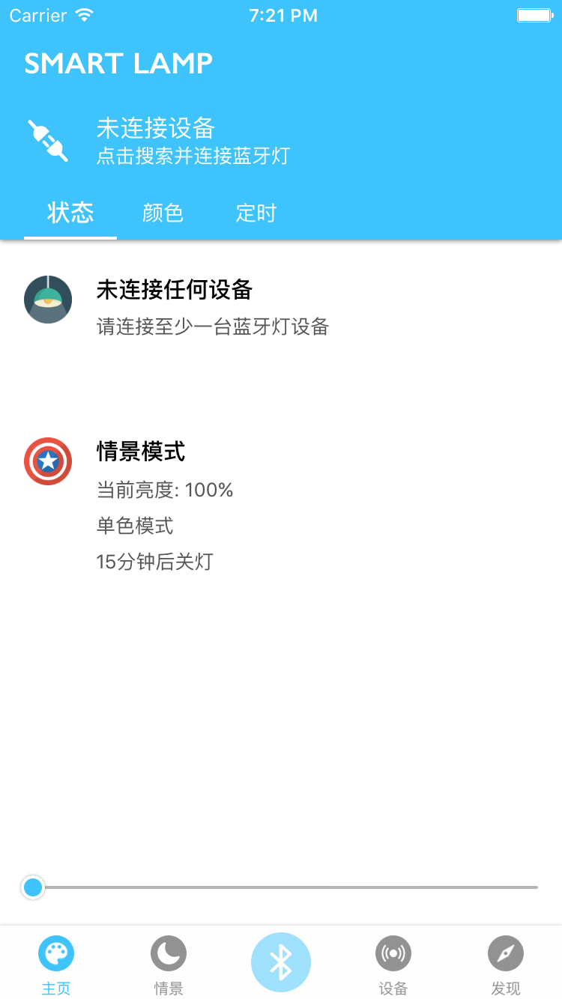
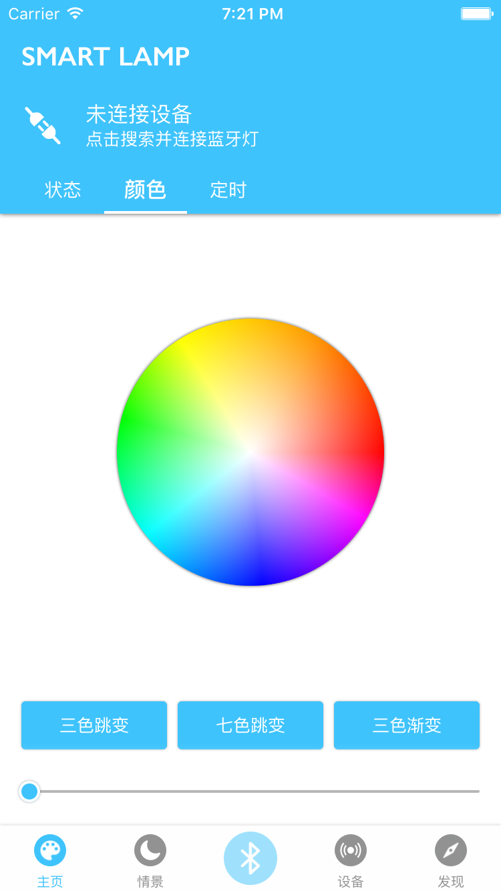
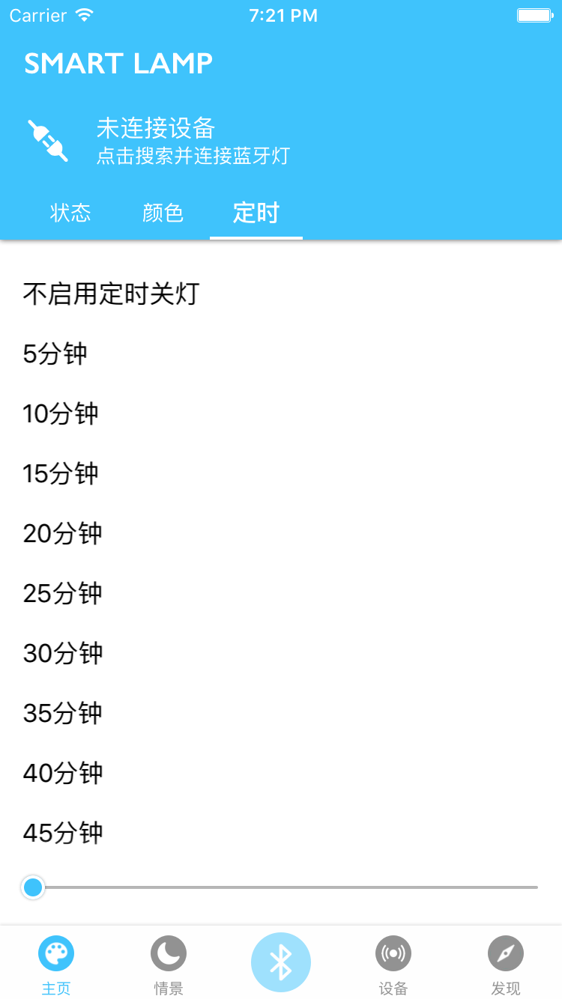
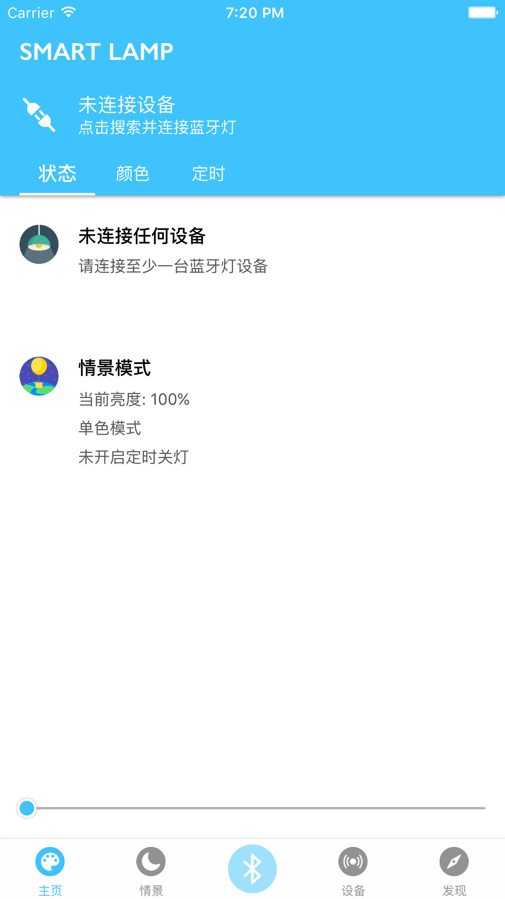
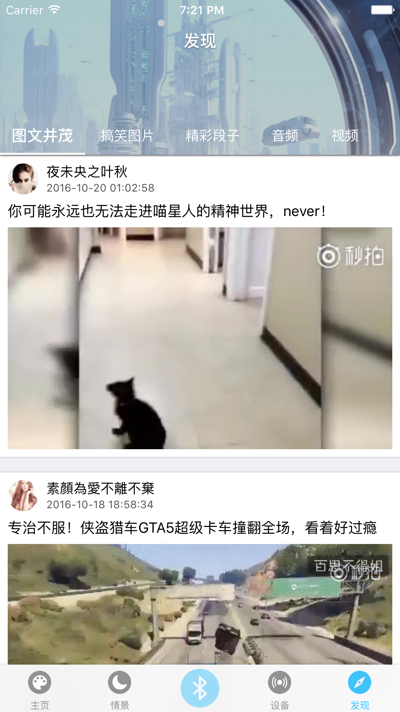

> 一键设置情景模式、无极调光调色、定时关灯。 
>
> 智能家居可以变得如此简单。

## 产品概述

● 功能简介

> 界面使用最广泛的四页面设计，分别为：主页、情景、设备、发现。 
>
> 主页是核心功能，实现一键连接蓝牙灯、自由调节颜色、亮度、设置定时关灯等功能。 
>
> 情景页是保存用户设置的情景模式，可以根据使用场景不同快速切换至对应的工作模式。 
>
> 设备页可以管理多台蓝牙灯。 
>
> 发现页提供一些智能家居相关资讯。

● 适用平台

> iOS 8 ~10.2

## ATTitleBar

- 支持横向滑动切换tab，并具有点击涟漪效果。详见[@ATKit](https://cocoapods.org/pods/atkit)。
- titlebar是在app中广泛应用的一种tab设计。我写的这个小框架模仿Google的[Material Design](https://www.uplabs.com/)设计，涟漪效果代码由[@MaterialControls](https://cocoapods.org/pods/MaterialControls)框架改写。 
- 页面较多时采用类似tableview的懒加载模式，只加载需要显示的几页，减少内存占用，提高流畅度。

## ReactiveCocoa

- 本项目大量使用了[@ReactiveCocoa](https://cocoapods.org/pods/ReactiveCocoa)框架进行响应式编程，大幅简化代码、提高可读性。 
- RAC的订阅机制使得一对多传值有了新的选择，如蓝牙中心设备。 
- RAC的信号监听机制使得我更容易根据需要定制个性化控件。如带翻转、旋转效果的tabbar、带缩放和回弹效果的slider等，使app的界面栩栩如生。

## CBCentralManager

- CBCentralManager是蓝牙类app的核心，本项目在编写这部分代码时使用了链式语法进行封装，外界调用起来十分方便。

## ATCarouselView

- 轮播图也是在app中广泛存在的一种自定义控件，我将这部分代码封装至[@ATKit](https://cocoapods.org/pods/atkit)中，以Pods导入方式使用，便于维护和扩展，同时也使得本项目代码更加简洁。 
- 部分app的轮播图可以根据下方列表的滑动而改变高度或者添加蒙版效果，我目前实现了改变高度的功能。

## 此外，一些细节问题

- 启动动画与侧滑界面

  本项目并没有开启侧滑界面，但是在编写的时候留有接口。 

  启动图片与主窗体下层的一个视图的背景图片相同，在启动的时候主窗体在屏幕右侧，以动画形式向左覆盖住图片。

- UINavigationBar和UITabBar的分割线

  如果需要自定义这两个bar，一般会把系统自带的一条分割线移除掉。 

  在模拟器中运行程序，观察层级结构，在执行Layout的时候移除掉对应层级的一个UIImageView。

- UITabBar中间自定义按钮

  在系统TabBar执行Layout的时候，重新排布原来的四个按钮，调整其大小和位置，然后新建一个按钮放在中间。

## Smart Lamp 要点概述

- 核心：中心设备（CBCentralManager）、外设（CBPeripheral）。
- 中心设备模型通过代理获取中心设备与周边设备之间的各种状态信息。
- 自定义了主页头视图支持滑动切换页面，并封装成工具类（详见GitHub）。
- 对第三方库进行了二次封装，减少内部代码对第三方库的依赖，便于后期维护。
- 中心设备模型对多个页面间的传值采用了Rac信号传值。
- 中心设备模型使用了链式语法封装，使用方便快捷。
- 封装了轮播图控件，并自适应header高度的变化。

## 分析问题 解决问题

- 蓝牙通信的流程？中心设备设置代理、开启扫描、停止扫描、获取周边对象、获取服务、获取特征、发送数据、接收返回数据。
- 如何实现多连？用数组存储多个设备及其特征，发送数据时分别向每个连接的设备发送数据，或单独向选中的设备发送数据。
- 蓝牙灯硬件响应的极限时间大概在20ms，如果手指滑动取色器太快导致蓝牙灯反应迟钝滞后，这个问题通过定时器来解决，定义一个flag，每隔50ms使其置为1，只有当flag为1的时候才可以发送数据，每次发送完数据使其置为0，这样就保证了发送数据的时间间隔不会小于50ms。
- 如何选择最合适的传值方式？最常用的三种Block、代理、通知。通知的特点是一对多，而代理和block是一对一传值，代理可以批量传递更多的信息，注重过程信息的传递，但是单例不能使用代理。block写法简练，功能强大，可以封装一段代码传递。
- 开灯时瞬间变亮太刺眼如何进行体验优化？创建一个定时器，每次开灯的时候设置亮度为0，每隔50ms左右调用一次增加一点亮度，直至亮度达到关灯前的状态。
- 关于丢包问题如何解决？可以对每一包发送的数据添加到数组里，每次从中取出一包发送，一定时间内没有收到返回值就重发。
- 如何防止数据被拦截？通常采取加密措施。拟定一份加密协议，对数据进行打乱、插值、重组等。

## 截图

#### iPhone 4寸

#### iPhone 4.7寸

#### iPhone 5.5寸

